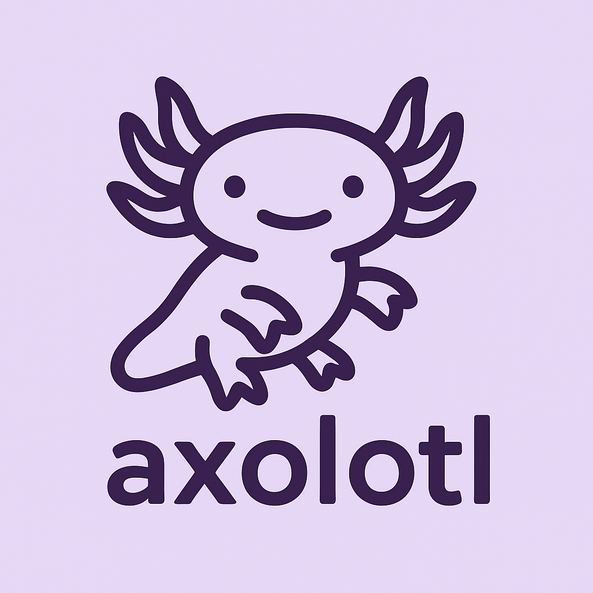

# Axolotl (AXO)



Axolotl is a small, statically-typed language and compiler implemented in modern C++. This repository contains the compiler, a tree-walking interpreter, and a VS Code language extension (syntax, grammar, and file icons).

**Status:** active development — builds and runs sample programs in `examples/`.

**Highlights:** lexer, parser (recursive-descent), interpreter, VS Code syntax & icons, and pretty diagnostics.

## **Features**
- **Lexer**: tokenizes source with line/column tracking
- **Parser**: recursive descent parser producing an AST
- **Interpreter**: tree-walking execution with scoped environments
- **Types**: `int`, `float`, `string`, `bool`, `void`, `object`, array types (`[type]`)
- **Control flow**: `if/else`, `while`, `for` (use `var` in `for` initializers)
- **Functions**: named and inline `func` values with typed parameters/returns
- **3D Graphics**: OBJ loading, skeletal bone animation with callback system, dev mode visualization
- **Dev Tools**: Bone and vertex visualization for debugging skeletal animations
- **VS Code integration**: syntax highlighting, grammar, and an icon theme
- **Pretty errors**: parse errors include file, line, column and a caret pointer to the offending token

## **Language Quick Reference**

Variable declarations

```
var name: type = value;
const name: type = value;
```

Functions

```
func functionName(param1: type1, param2: type2) -> returnType {
    // body
}
```

For loops (note: the parser expects `var` or an expression for the initializer):

```
for (var i: int = 0; i < len(arr); i = i + 1) {
    // ...
}
```

Array type

```
const a: [int] = [1, 2, 3];
```

Operators: arithmetic `+ - * / %`, comparison `== != < > <= >=`, logical `&& || !`.

## **Repository Layout**
- `src/` — C++ sources: lexer, parser, interpreter, main, etc.
- `include/` — public headers
- `examples/` — example `.axo` programs
- `lang-ext/` — VS Code extension (language, grammar, icon theme)
- `build/` — CMake build outputs

## **Build & Run**

Prerequisites
- C++17 toolchain (Apple Clang or GCC/Clang)
- CMake 3.10+
- LLVM, SDL2, SDL2_image, curl, GTK3 (for full features)

From the repository root (recommended):

```bash
# configure + build (out-of-source)
cmake -S . -B build -DCMAKE_BUILD_TYPE=Release
cmake --build build -j$(nproc)

# OR use Makefile
make build

# run an example
./build/compiler examples/test.axo

# compile to standalone executable (embeds full interpreter)
./build/compiler compile sample/index.axo MyGame
./MyGame

# compile with icon (cross-platform)
./compile_standalone.sh sample/index.axo MyGame sample/icon.png
# macOS: creates MyGame.app bundle
# Linux: creates MyGame executable + .desktop file
# Windows: creates MyGame.exe with embedded icon

# interactive REPL mode
./build/compiler
```

If you previously built in a different folder, remove `build/` and re-run `cmake -S . -B build` to avoid stale cache issues.

## **Standalone Executables**

The compiler can create TRUE standalone executables that bundle the entire Axolotl interpreter and your source code into a single binary requiring no external dependencies:

```bash
# Quick compile
./build/compiler compile myapp.axo myapp

# With icon support (recommended)
./compile_standalone.sh myapp.axo myapp path/to/icon.png
```

The standalone compiler:
- Embeds the full Axolotl interpreter
- Bundles all source code
- Creates platform-specific executables:
  - **macOS**: `.app` bundle with icon
  - **Linux**: executable with `.desktop` file
  - **Windows**: `.exe` with embedded icon
- No runtime dependencies on Axolotl installation

## **VS Code Extensions**

The `vs-code-extentions/` folder contains multiple VS Code extensions:
- **axolotl-highlighter**: Syntax highlighting and language support
- **axolotl-intelsense**: IntelliSense and autocomplete
- **axolotl-formater**: Code formatting

Build all extensions at once:

```bash
# Build all extensions to VSIX packages
./build_extensions.sh

# OR use Makefile
make extensions

# Install extensions
code --install-extension build/extensions/axolotl-highlighter.vsix
code --install-extension build/extensions/axolotl-intelsense.vsix
code --install-extension build/extensions/axolotl-formater.vsix
```

Manual build (single extension):

```bash
cd vs-code-extentions/axolotl-highlighter
npm install -g @vscode/vsce
vsce package
code --install-extension axolotl-highlighter-1.0.0.vsix
```

After installing:
- Reload VS Code window
- Open any `.axo` file to activate extensions
- IntelliSense will provide autocomplete suggestions

## **Error Reporting / Diagnostics**

The compiler now produces improved diagnostics for parse errors. Example:

```
Fatal error: Expected ']' after array type (line 1, col 14)
  File: examples/bad_array.axo:1:14
const a:[int = 5;
             ^
```

Notes:
- Parse errors carry token line/column and show the source line with a caret marker.
- This formatting is produced when running `./build/compiler <file>`; interactive mode prints similar errors when a complete expression/block is entered.

## **Examples**

Run the example suite to try small programs in `examples/`:

```bash
./build/compiler examples/test.axo
```

Compile an example to a standalone executable:

```bash
./build/compiler compile examples/test.axo test_program
./test_program
```

Try the bone animation demo:

```bash
./build/compiler tests/bone_animation_demo.axo
```

Try the bone visualization demo:

```bash
./build/compiler tests/bone_visualization_demo.axo
```

Open `examples/test.axo` and `examples/showcase.axo` to see language features.

See `docs/BONE_ANIMATION.md` for the complete bone animation API.

See `docs/BONE_VISUALIZATION.md` for bone and vertex visualization in dev mode.

## **Development Notes**

- `Token` objects track `line` and `column` in `include/token.h`.
- `ParseError` (in `include/parser.h`) now stores token location and value — the `main` runner formats these into the caret-style diagnostic.
- If you change parsing/lexing behavior, update tests and examples accordingly.

## **Contributing / Roadmap**

- Improve type checking and error recovery
- Add more standard library functions
- Add bytecode backend and JIT

## **License**

MIT

- Function call support with parameter passing
